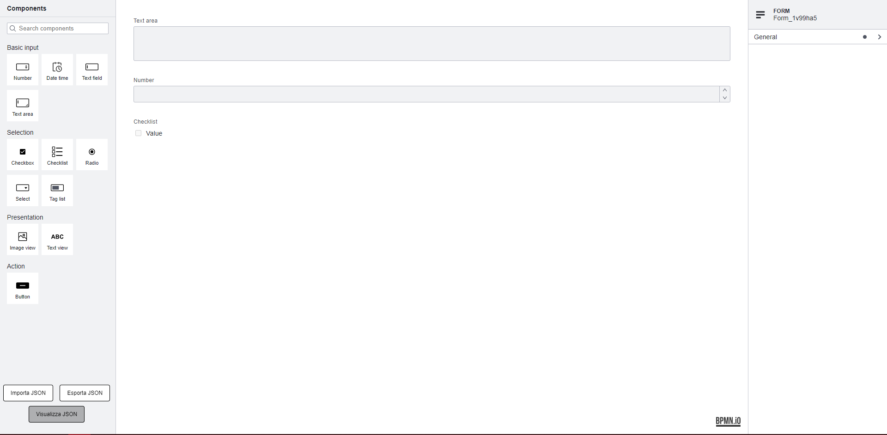

> Questa applicazione è stata realizzata partendo dagli esempi forniti sul GitHub ufficiale della libreria form-js [:notebook: form-js guide](https://github.com/bpmn-io/form-js).

# Changelog

Tutti i cambiamenti notevoli a questo progetto verranno documentati nel file [CHANGELOG.md](./CHANGELOG.md)

# Form-js editor

[](https://github.com/bpmn-io/bpmn-js)

L'applicazione legge le configurazioni principali (come host e basepath) da un file di configurazione <b> .env </b>.

Il file di configurazione è così formato:

```conf

HOST=localhost
BASEPATH=/bpm/form
PORT=443

```

E' possibile cambiare l'host o il basepath dell'applicazione in qualunque momento senza dover effettuare altre modifiche al codice.

Nell'esempio riportato, l'applicazione verrà così eseguita all'indirizzo ```https://localhost/bpm/form ```


Attualmente è possibile avviare l'applicazione tramite l'uso di node js ed npm oppure tramite container docker.


Screenshot raffigurante l'editor [form-js](https://github.com/bpmn-io/form-js) con form pre-caricato recuperato da chiamata API




## About

Questo progetto crea un editor di form con la possibilità di aggiungere tutti gli elementi di base forniti dalla libreria nella palette di sinistra. 
E' presente inoltre un pannello delle proprietà che consente la personalizzazione degli elementi aggiunti all'editor.
Infine, sono state implementate le funzionalità per import/export di JSON tramite file.


Le principali funzionalità attualmente supportare sono:

* Lettura ed apertura form tramite chiamata API
* Import e render di form tramite import file json (anche drag&drop)
* Visualizzazione codice json generato dall'editor tramite apposito pulsante
* Pannello proprietà per gestire tutti gli elementi dell'editor


## JSON example

Il JSON generato dall'editor avrà una struttura simile a questa:

```json
{
  "components": [
    {
      "label": "Text area",
      "type": "textarea",
      "id": "Field_064dbuc",
      "key": "field_12355dm"
    },
    {
      "label": "Number",
      "type": "number",
      "id": "Field_0cde7xw",
      "key": "field_0mv7uus"
    },
    {
      "values": [
        {
          "label": "Value",
          "value": "value"
        }
      ],
      "label": "Checklist",
      "type": "checklist",
      "id": "Field_143dysh",
      "key": "field_112no48"
    }
  ],
  "schemaVersion": 7,
  "exporter": {
    "name": "Foo Editor",
    "version": "1.0.0"
  },
  "type": "default",
  "id": "Form_1v99ha5",
  "executionPlatform": "Camunda Platform",
  "executionPlatformVersion": "7.16.0"
}
```


## Avviare l'applicazione (Node JS)

Sarà necessario installare [NodeJS](http://nodejs.org) insieme ad [npm](https://npmjs.org) per fare il build del progetto ed avviarlo.

Per installare tutte le dipendenze:

```sh
npm install
```

Per avviare l'applicazione:

```sh
npm start
```

Per effettuare il build dell'applicazione:

```sh
npm run build
```

## Avviare l'applicazione (Docker)

Dai i permessi necessari a tutta la cartella <b>Form_JS</b> in maniera ricorsiva

```sh
sudo chmod 755 -R Form_JS
```

Effettua build dell'immagine e run del container dall'interno della cartella <b>Form_JS</b>:

```sh
docker-compose up --build
```