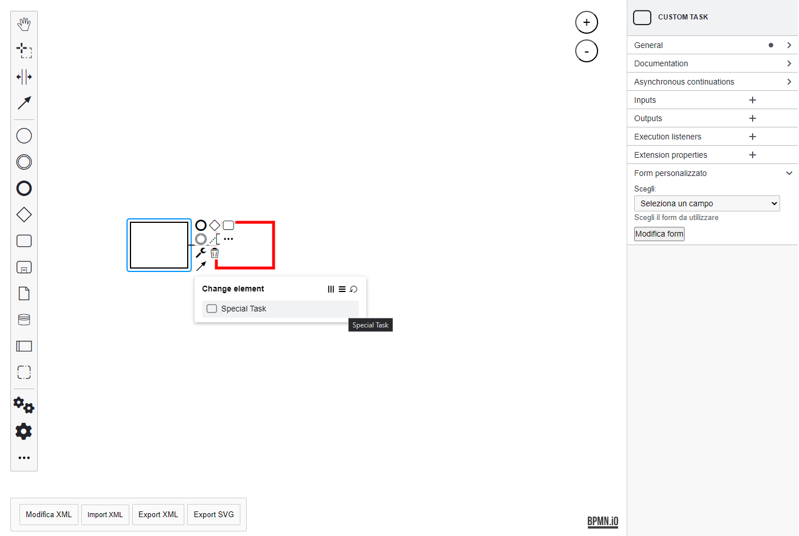
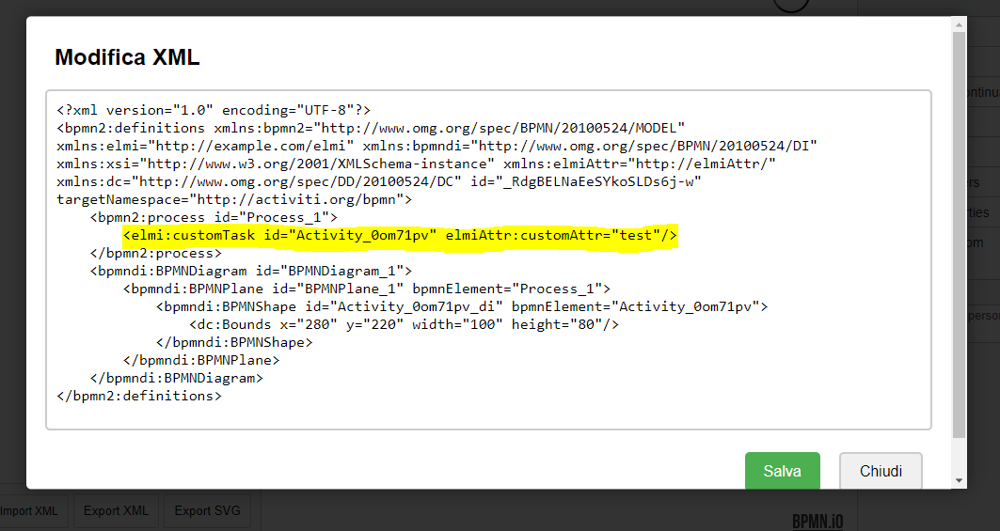

> Questa applicazione è stata realizzata partendo dagli esempi forniti sul GitHub ufficiale della libreria bpmn-js [:notebook: bpmn-js guide](https://github.com/bpmn-io/bpmn-js-examples/tree/master/custom-elements).

# Changelog

Tutti i cambiamenti notevoli a questo progetto verranno documentati nel file [CHANGELOG.md](./CHANGELOG.md)

# Custom bpmn-js editor

[](https://github.com/bpmn-io/bpmn-js)

L'applicazione legge le configurazioni principali (come host e basepath) da un file di configurazione <b> .env </b>.

Il file di configurazione è così formato:

```conf

HOST=localhost
BASEPATH=/bpm/modeler
PORT=443

```

E' possibile cambiare l'host o il basepath dell'applicazione in qualunque momento senza dover effettuare altre modifiche al codice.

Nell'esempio riportato, l'applicazione verrà così eseguita all'indirizzo ```https://localhost/bpm/modeler ```


Attualmente è possibile avviare l'applicazione tramite l'uso di node js ed npm oppure tramite container docker.


Screenshot raffigurante l'editor [bpmn-js](https://github.com/bpmn-io/bpmn-js) con l'integrazione di componenti custom e pannello impostazioni personalizzato con campo estensione personalizzato.




## About

Questo progetto crea un editor BPMN con la possibilità di creare task personalizzati che permettono di aggiungere metadati custom all'XML generato.
E' possibile inoltre registrare attributi personalizzati da poter aggiungere ai componenti tramite il pannello delle proprietà; un esempio di integrazione è stato effettuato collegando l'editor BPM con l'editor di form, tramite form js, che consente agli utenti di modificare un form esistente.

La realizzazione è stata effettuata seguendo la guida ufficiale per l'integrazione dei vari componenti -> [:notebook: custom elements guide](https://github.com/bpmn-io/bpmn-js-examples/tree/master/custom-elements)

Le principali funzionalità attualmente supportare sono:

* Modellare e leggere i dati degli elementi personalizzati tramite [model extension](https://github.com/bpmn-io/bpmn-js-example-model-extension)
* Rendering di elementi personalizzati con una forma custom -> [custom shape](https://github.com/bpmn-io/bpmn-js-example-custom-rendering)
* Aggiunta di controlli dell'editor che consentono di creare elementi personalizzati -> [editor controls](https://github.com/bpmn-io/bpmn-js-example-custom-controls)
* Modifica dei form (form js) tramite apposita estensione custom inserita nel pannello proprietà

Per vedere maggiori dettagli:

* [Creating a model extension](#creating-a-model-extension)
* [Creating custom rendering](#creating-custom-rendering)

## Creating a Model Extension

Utilizzando un'estensione del modello possiamo leggere, modificare e scrivere diagrammi BPMN 2.0 che contengono, per esempio, elementi personalizzati del tipo `elmi:customTask` con attributi personalizzati del tipo `elmiAttr:customAttr`.

L'XML di un elemento di questo tipo ha un aspetto simile a questo:

```xml
 <bpmn2:process id="Process_1">
        <elmi:customTask id="Activity_1nw7j81" elmiAttr:customAttr="fwerrfew"/>
    </bpmn2:process>
    <bpmndi:BPMNDiagram id="BPMNDiagram_1">
        <bpmndi:BPMNPlane id="BPMNPlane_1" bpmnElement="Process_1">
            <bpmndi:BPMNShape id="Activity_1nw7j81_di" bpmnElement="Activity_1nw7j81">
                <dc:Bounds x="310" y="250" width="100" height="80"/>
            </bpmndi:BPMNShape>
        </bpmndi:BPMNPlane>
    </bpmndi:BPMNDiagram>
```




Per ulteriori informazioni sulla creazione di estensioni del modello, vedi: [model extension example](https://github.com/bpmn-io/bpmn-js-example-model-extension).


## Creating Custom Rendering

Utilizzando un renderer personalizzato, possiamo visualizzare i nostri elementi personalizzati definendo le proprietà grafiche da attribuire (forma, colore, dimensione..).

```javascript
this.drawShape = function(parentNode, element) {
    const rect = svgCreate('rect');

    // Imposta l'attributo dell'elemento SVG
    rect.setAttribute('width', element.width);
    rect.setAttribute('height', element.height);
    rect.setAttribute('stroke', 'black');
    rect.setAttribute('fill', 'white');
    rect.setAttribute('stroke-width', 2);

    svgAppend(parentNode, rect);

    return rect;
  };
```

Per ulteriori informazioni sui rendering personalizzati, vedi: [custom rendering example](https://github.com/bpmn-io/bpmn-js-example-custom-rendering).


#### Palette

Il codice seguente consente di creare elementi custom ed aggiungerli alla palette tra i task selezionabili dall'utente.

```javascript
  'create.customTask': {
    group: 'mattoncini-custom',
    className: 'fas fa-cogs',
    title: translate('mattoncino custom'),
    action: {
      dragstart: createCustomTask(),
      click: createCustomTask()
    }
  }
```

```javascript
  function createCustomTask() {
    return function(event) {
      const businessObject = bpmnFactory.create('elmi:CustomTask');
      const shape = elementFactory.createShape({
        type: 'elmi:CustomTask',
        businessObject: businessObject
      });
      create.start(event, shape);
    };
  }
```

Per visualizzare tutte le funzionalità per la crezione di controlli personalizzabili vedi: [custom controls example](https://github.com/bpmn-io/bpmn-js-example-custom-controls).


## Avviare l'applicazione in locale (Node JS)

Sarà necessario installare [NodeJS](http://nodejs.org) insieme ad [npm](https://npmjs.org) per fare il build del progetto ed avviarlo.

Per installare tutte le dipendenze:

```sh
npm install
```

Per avviare l'applicazione:

```sh
npm start
```

Per avviare l'applicazione (modalità debug):

```sh
npm run dev
```

Per effettuare il build dell'applicazione dentro la cartella `public`:

```sh
npm run all
```
o

```sh
npm run build
```

## Avviare l'applicazione (Docker)

Dai i permessi necessari a tutta la cartella <b>Modeler</b> in maniera ricorsiva

```sh
sudo chmod 755 -R Modeler
```

Effettua build dell'immagine e run del container dall'interno della cartella <b>Modeler</b>:

```sh
docker-compose up --build
```