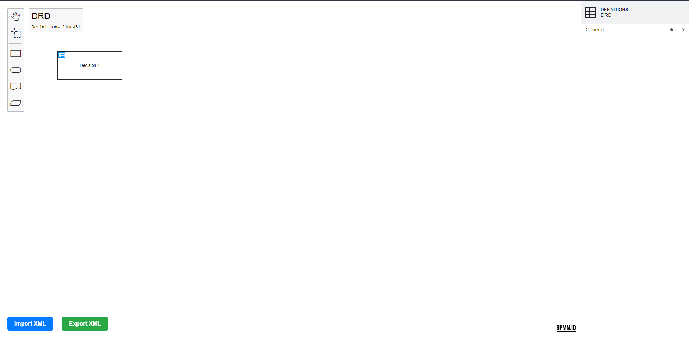
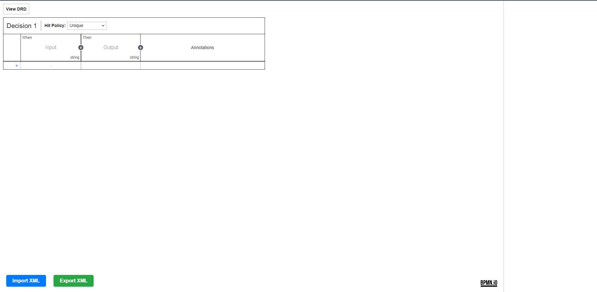

> Questa applicazione è stata realizzata partendo dagli esempi forniti sul GitHub ufficiale della libreria dmn-js [:notebook: dmn-js guide](https://github.com/bpmn-io/dmn-js).

# Changelog

Tutti i cambiamenti notevoli a questo progetto verranno documentati nel file [CHANGELOG.md](./CHANGELOG.md)

# DMN-js editor

[](https://github.com/bpmn-io/dmn-js)

L'applicazione legge le configurazioni principali (come host e basepath) da un file di configurazione <b> .env </b>.

Il file di configurazione è così formato:

```conf

HOST=localhost
BASEPATH=/bpm/dmn
PORT=443

```

E' possibile cambiare l'host o il basepath dell'applicazione in qualunque momento senza dover effettuare altre modifiche al codice.

Nell'esempio riportato, l'applicazione verrà così eseguita all'indirizzo ```https://localhost/bpm/dmn ```


Attualmente è possibile avviare l'applicazione tramite l'uso di node js ed npm oppure tramite container docker.


Screenshot raffigurante l'editor [dmn-js](https://github.com/bpmn-io/dmn-js)



<br>



## About

Questo progetto crea un editor dmn con la possibilità di aggiungere tutti gli elementi di base forniti dalla libreria nella palette di sinistra. 
E' presente inoltre un pannello delle proprietà che consente la personalizzazione degli elementi aggiunti all'editor.
Infine, sono state implementate le funzionalità per import/export XML.


Le principali funzionalità attualmente supportare sono:

* Lettura ed apertura file tramite chiamata API
* Import/Export file XML
* Pannello proprietà per gestire tutti gli elementi dell'editor


## XML example

L'XML generato dall'editor avrà una struttura simile a questa:

```xml
<?xml version="1.0" encoding="UTF-8"?>
<definitions xmlns="https://www.omg.org/spec/DMN/20191111/MODEL/" xmlns:dmndi="https://www.omg.org/spec/DMN/20191111/DMNDI/" xmlns:dc="http://www.omg.org/spec/DMN/20180521/DC/" id="Definitions_1lmea3i" name="DRD" namespace="http://camunda.org/schema/1.0/dmn">
  <decision id="Decision_0mqgtic" name="Decision 1">
    <decisionTable id="DecisionTable_11azyal">
      <input id="Input_1">
        <inputExpression id="InputExpression_1" typeRef="string">
          <text></text>
        </inputExpression>
      </input>
      <output id="Output_1" typeRef="string" />
    </decisionTable>
  </decision>
  <knowledgeSource id="KnowledgeSource_1pgb0lj" />
  <businessKnowledgeModel id="BusinessKnowledgeModel_0410j2q" />
  <dmndi:DMNDI>
    <dmndi:DMNDiagram>
      <dmndi:DMNShape dmnElementRef="Decision_0mqgtic">
        <dc:Bounds height="80" width="180" x="180" y="190" />
      </dmndi:DMNShape>
      <dmndi:DMNShape id="DMNShape_0sikxt2" dmnElementRef="KnowledgeSource_1pgb0lj">
        <dc:Bounds height="63" width="100" x="420" y="329" />
      </dmndi:DMNShape>
      <dmndi:DMNShape id="DMNShape_10055wd" dmnElementRef="BusinessKnowledgeModel_0410j2q">
        <dc:Bounds height="46" width="135" x="572" y="207" />
      </dmndi:DMNShape>
    </dmndi:DMNDiagram>
  </dmndi:DMNDI>
</definitions>
```

## Avviare l'applicazione (Node JS)

Sarà necessario installare [NodeJS](http://nodejs.org) insieme ad [npm](https://npmjs.org) per fare il build del progetto ed avviarlo.

Per installare tutte le dipendenze:

```sh
npm install
```

Per avviare l'applicazione:

```sh
npm start
```

Per effettuare il build dell'applicazione:

```sh
npm run build
```

## Avviare l'applicazione (Docker)

Dai i permessi necessari a tutta la cartella <b>dmn</b> in maniera ricorsiva

```sh
sudo chmod 755 -R dmn
```

Effettua build dell'immagine e run del container dall'interno della cartella <b>dmn</b>:

```sh
docker-compose up --build
```